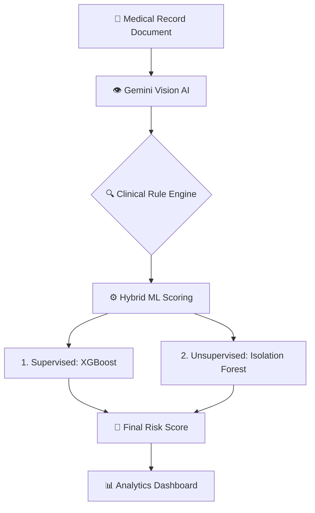

# 🏥 VeraMed AI: BPJS Claim Fraud Detection & Medical Audit

VeraMed AI is a healthcare claim anomaly detection system specifically designed for the Indonesian BPJS Kesehatan ecosystem. This project combines the power of **Hybrid Machine Learning** for mass claim data analysis and **Gemini Vision AI** for cognitive audits of physical medical record documents.

## 📌 Why VeraMed AI?
Based on research data, approximately **59.43%** of BPJS claim issues stem from incomplete or invalid medical documentation. VeraMed AI automates this verification process, detects potential *inflated costs*, and validates administrative authenticity in real-time.

---

## 🚀 Key Features

### 1. Hybrid Risk Scoring
The system uses a dual-model approach to generate a risk score (0-100):
*   **Supervised (XGBoost)**: Learns fraud patterns from historical labeled data.
*   **Unsupervised (Isolation Forest)**: Detects statistical anomalies in claims that look "weird" even without precedent (e.g., drastically inflated fever treatment costs).

### 2. AI Medical Document Extractor (Gemini Vision)
A cognitive audit module capable of reading photos or PDFs of medical records to:
*   Extract data into a structured JSON format.
*   Verify the presence of the attending physician's (DPJP) signature.
*   Check the completeness of the medical resume according to Ministry of Health standards.

### 3. Interactive Analytics Dashboard
A Streamlit-based dashboard presenting:
*   Cost distribution visualization per ICD-10 code.
*   Detailed claim audits with explanations for anomalies (Explainable AI).
*   Export capabilities for audit results to datasets for continuous model training.

---

## 🏗️ System Architecture



---

## 📊 Model Performance Highlights

Here is the performance summary of **VeraEngine v4.2**:

| Metric | Score | Note |
| :--- | :--- | :--- |
| **ROC-AUC** | **0.9886** | **Excellent Performance** |
| XGBoost Accuracy | 95.0% | High precision in fraud pattern matching |
| Fraud Miss Rate | 6.5% | Minimal leakage of suspicious claims |
| Identified Risk | Rp 1.21 Billion | Potential savings from synthetic test data |

---

## 🛠️ Technologies Used
*   **Core**: Python 3.10+
*   **Machine Learning**: XGBoost, Scikit-Learn (Isolation Forest)
*   **AI Engine**: Google Gemini 2.0 Flash Lite (Vision API)
*   **Dashboard**: Streamlit, Plotly
*   **Data Handling**: Pandas, PyArrow, Joblib

---

## 📦 Installation & Setup

1. **Clone the Repository**
   ```bash
   git clone https://github.com/username/VeraMed-Ai.git
   cd VeraMed-Ai
   ```

2. **Install Dependencies**
   ```bash
   pip install -r requirements.txt
   ```

3. **Environment Configuration**
   Copy `.env.example` to `.env` and insert your API Key:
   ```env
   GOOGLE_API_KEY=AIzaSy...
   GEMINI_MODEL=gemini-2.0-flash-lite
   APP_ENV=production
   ```

---

## 💻 Usage Guide

### A. Train the Model
Run the training script to generate the latest `.pkl` model based on the synthetic dataset:
```bash
python train_model.py
```

### B. Evaluate the Model
View an in-depth model performance report (Accuracy, Precision, Recall, ROC-AUC):
```bash
python evaluate_model.py
```

### C. Run the Dashboard
Launch the local web application:
```bash
streamlit run app.py
```

---

## 🧠 Audit Logic Architecture
VeraMed AI does not solely rely on numbers, but also strict medical rules:
1.  **Inflated Cost**: If the diagnosis is `R50.9` (Fever) but the cost > Rp 5,000,000.
2.  **Admin Validity**: Claims are automatically flagged as high risk if the doctor's signature is not detected by AI (50.69% weight impact).
3.  **Short Stay High Cost**: Length of stay (LOS) is only 1 day, but the cost exceeds the threshold for minor procedures.

---

## 📄 Project Structure
```text
├── app.py                   # Dashboard application entry point
├── train_model.py           # ML training pipeline
├── evaluate_model.py        # Performance evaluation metrics
├── extractor.py             # Gemini OCR & Audit engine
├── pages/                   # Additional Streamlit page modules
├── models/                  # Directory for saved .pkl models
└── bpjs_claims_synthetic.csv # Training dataset
```

---

## 🛡️ Data Privacy & Future Roadmap

Given the sensitivity of healthcare data, VeraMed AI is designed with a strict data governance vision:

*   **Prototype Phase**: Currently utilizing **Gemini 2.0 Flash Lite** for fast and accurate cognitive document extraction via TLS encryption.
*   **Production Phase**: Transitioning to **Gemma (Local LLM)** deployed *on-premise* using **AWS SageMaker** infrastructure. This step ensures full data sovereignty and compliance with patient data privacy regulations (**GDPR** & **UU PDP Indonesia**), where medical data never leaves the internal hospital/BPJS network.

---

## ⚖️ License & Disclaimer
This system is a Decision Support System and is not intended to fully replace human verifiers. All data used in this demo is randomly generated synthetic data for developmental purposes.

© 2026 **VeraMed AI Team**
